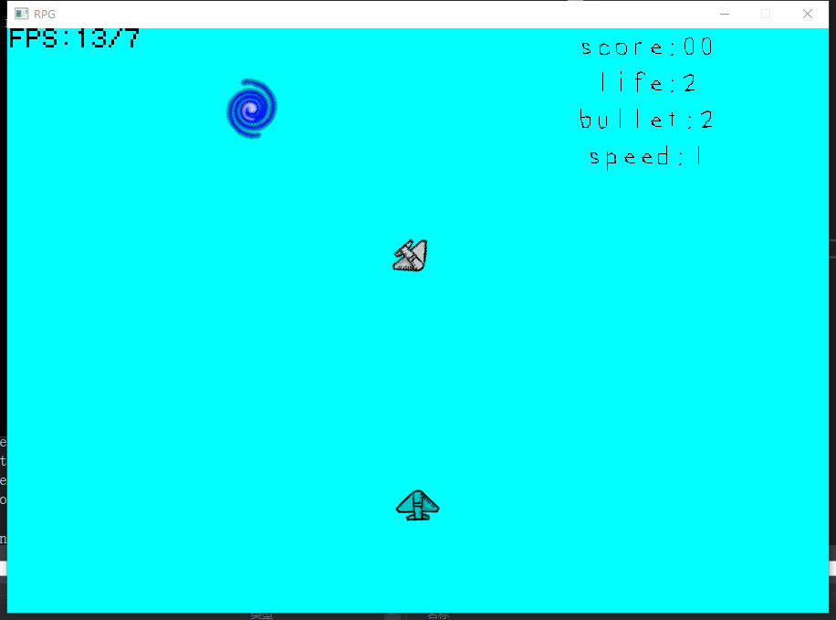
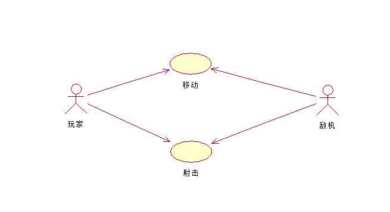
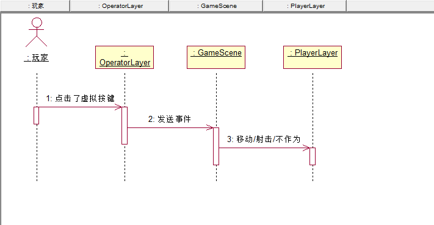
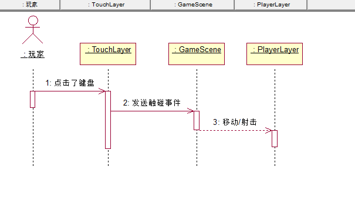

# 1. 简介
>本游戏是基于SDL_Engine开发的一个飞机大战的游戏，在内部采用了box2d作为物理碰撞。
>游戏截图: 
>
> 2. 关于本游戏
>用例图
> 
>游戏中仅仅存在两个角色，分别是玩家和敌方飞机，在性质方面，玩家的飞机和地方的飞机并没有什么
>本质上的区别，区别在于一个为玩家所操作，另一个为敌方的判断语句（不能算是AI）所控制。
>次序图
>分别为在移动端和windows端的事件触发
> 
> 
# 3. 不满意的地方
>1. GameScene有太多的Delegate
>2. 在何处实现bullet的数目更新,目前是在PlayerLayer::update()每次发送信息
>3. 使用物理碰撞时，都是使用的是body，来获取对应的实体，今天用Fixture，会无时无刻在碰撞。莫名其妙